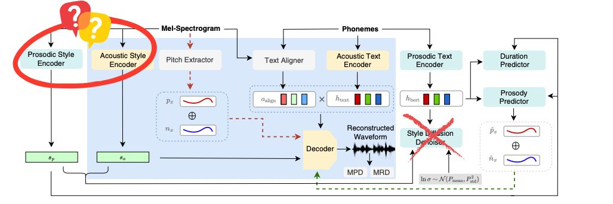

# train-kokoro-encoder-styletts2

An experimental open-source attempt to retrain the missing **Kokoro TTS** encoders using a modified **StyleTTS2** framework to enable custom voice cloning.

## 📌 Project Purpose
While Kokoro TTS is based on StyleTTS2, its official release only included the decoder weights. This project is an experimental attempt to retrain the missing encoders to explore custom voice cloning and generate new voice packs.

## 💡 Motivation & Core Architecture Insights
When analyzing the architectural differences between Kokoro TTS and StyleTTS2, a key distinction stands out: the removal of the **Style Diffusion Denoiser** module.

Furthermore, the official Kokoro voicepack tensor shapes and file sizes align perfectly with the dimensions required by the original StyleTTS2 architecture. This heavily implies that the **Prosodic Style Encoder** and **Acoustic Style Encoder** were actively utilized during the initial training of Kokoro but simply withheld from the public release.

This project aims to reconstruct those missing components to unlock the full potential of the model's architecture.

## 📊 Current State
The training pipeline runs successfully, but initial zero-shot voice cloning results are sub-optimal. According to the original author of Kokoro TTS, high-quality voice cloning may not be achievable under these conditions due to limited training data and time.

However, the pipeline has successfully trained a voice pack encoder. The resulting voice packs are fully functional and compatible with the official Kokoro V1 release model. This repository is open-sourced to share these findings and artifacts with the community.

## 🤗 Pre-trained Models & Voice Packs
The fine-tuned checkpoints from this training pipeline, along with ready-to-use custom voice packs (such as Tony and Vivien), are hosted on our Hugging Face repository:

[**gushilabs/gushilabs-voices-for-kokoro-v1**](https://huggingface.co/gushilabs/gushilabs-voices-for-kokoro-v1)

You can download the large model weights (`.pth` files) from Hugging Face and use them alongside the extraction scripts provided in this GitHub repository to generate your own custom Kokoro-compatible `.pt` voice packs.

## 🙏 Background & Credits
Initially, I attempted to use the vanilla [StyleTTS2](https://github.com/yl4579/StyleTTS2) training code to train the Kokoro encoders, but the codebase crashed frequently during adaptation. 

During my research, I discovered [semidark/kokoro-deutsch](https://github.com/semidark/kokoro-deutsch), an excellent repository that patched the StyleTTS2 code to successfully skip diffuser sampling. I modified and adapted the training logic from the `semidark` repository to get this specific Kokoro encoder training pipeline working. 

Massive credit and thanks to the author of `semidark/kokoro-deutsch` for the patched StyleTTS2 baseline!
