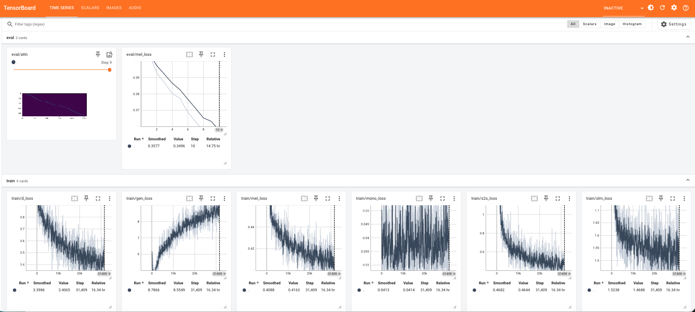
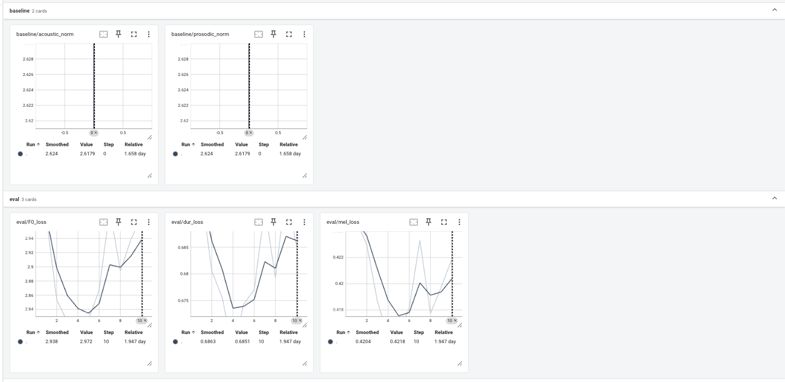

# Training Guide

## 1) Prerequisites

### Hardware

| Hardware | Status | Notes |
|----------|--------|-------|
| NVIDIA (CUDA) | Recommended | Any GPU with 10GB+ VRAM. batch_size=4 works on 12GB. |
| AMD (ROCm) | Works with caveats | See [AMD ROCm Notes](TROUBLESHOOTING.md#amd-rocm-notes). |
| CPU only | Not practical | Training would take weeks. |

### System Dependencies

```bash
# Ubuntu/Debian
sudo apt-get install espeak-ng libsndfile1

# macOS
brew install espeak-ng libsndfile
```

Both are mandatory. `espeak-ng` drives the IPA phonemization (`misaki`). `libsndfile` is required by `soundfile` for WAV I/O.

### Python Environment

- Python: 3.10–3.13 (tested on 3.13.12; see `requires-python` in `pyproject.toml`)
- Package manager: `uv`

```bash
git clone --recurse-submodules https://github.com/semidark/kokoro-deutsch
cd kokoro-deutsch
uv sync
```

The training environment for StyleTTS2 is separate and uses a venv:

```bash
pip install torch torchaudio  # match your CUDA/ROCm version
pip install accelerate transformers
pip install librosa soundfile pyyaml tensorboard
pip install munch phonemizer huggingface_hub
pip install Cython  # required to build monotonic_align
```

## 2) Prepare Dataset

Create file lists in StyleTTS2 format:

`path/to/audio.wav|IPA phoneme string|speaker_name`

Requirements:
- WAV, mono, 24kHz, 16-bit
- Typical clip duration: 2–30s
- Keep phoneme strings compatible with Kokoro symbols (see [Phoneme Compatibility]

Use:
- `scripts/prepare_dataset_libritts.py`
- `scripts/prepare_training_libritts.py`

## 3) Prepare Base Weights

Convert Kokoro HuggingFace weights into StyleTTS2-compatible checkpoint format:

```python
import torch

raw = torch.load('kokoro-v1_0.pth', weights_only=False)

def strip_prefix(state_dict):
    return {k.replace('module.', ''): v for k, v in state_dict.items()}

net = {
    'bert': strip_prefix(raw['bert']),
    'bert_encoder': strip_prefix(raw['bert_encoder']),
    'predictor': strip_prefix(raw['predictor']),
    'text_encoder': strip_prefix(raw['text_encoder']),
    'decoder': strip_prefix(raw['decoder']),
}
torch.save({'net': net}, 'kokoro_base.pth')
```

Set `load_only_params: true` in the config so StyleTTS2 uses `strict=False` when loading — this silently ignores missing keys for components not present in Kokoro (diffusion network, SLM discriminator).

## 4) Symbol Mapping (Critical)

StyleTTS2 default token indices do not match Kokoro token indices.

Required:
- `StyleTTS2/text_utils.py` must import from `kokoro_symbols.py`
- `kokoro_symbols.py` must contain the 178-token Kokoro mapping

Verify:

```python
from kokoro_symbols import symbols, dicts, TextCleaner
assert len(symbols) == 178
tc = TextCleaner()
assert dicts['ç'] == 78   # ich-Laut
assert dicts['ʦ'] == 20   # ts affricate
assert dicts['ː'] == 158  # length mark
```

Without this, training appears to run but token embeddings are silently wrong.

## 5) StyleTTS2 Environment

`StyleTTS2/` is a patched submodule with required fixes already included.

You still need utility models:
- `Utils/JDC/bst.t7`
- `Utils/ASR/config.yml` and `Utils/ASR/epoch_00080.pth`
- `Utils/PLBERT/*`

Build monotonic alignment extension:

```bash
cd StyleTTS2/monotonic_align
python setup.py build_ext --inplace
```

## 6) Configure Training

Primary config: `configs/config.yml`

### Critical: Top-Level vs Nested Parameters

`train_first.py` reads critical parameters from the **top level** of the YAML, not from the nested `training:` block:

### Important Stage 2 Settings

## 7) Smoke Test

Before long runs, verify each component:

1. **Symbol map:** loads and has length 178 (see step 4)
2. **Model loads:** no size mismatch errors (missing keys for diffusion/SLM are expected)
3. **Forward + backward pass:** all losses are finite (not NaN or inf)
4. **Run 2 training steps** and Ctrl+C after confirming non-NaN losses

## 8) Stage 1 Training

Run from `StyleTTS2/`:

```bash
accelerate launch train_first.py --config_path ../configs/config.yml
```



## 9) Stage 2 Training

Run from `StyleTTS2/`:

```bash
accelerate launch train_second.py --config_path ../configs/config.yml
```



## 10) Extract Voicepack and Test Inference

Extract:

```bash
python scripts/extract_voicepack.py \
  --model models/epoch_2nd_00006.pth \
  --audio-dir LibriTTSClean100/Data/wavs/speaker_5703 \
  --output voices/am_2epoch6_speaker5703.pt
```

Convert/test inference:

```bash
  python scripts/test_inference.py \
    --model models/kokoro-v1_0/kokoro-v1_0.pth \
    --voicepack voices/am_2epoch6_speaker5703.pt \
    --output-dir test_output/epoch6
```
